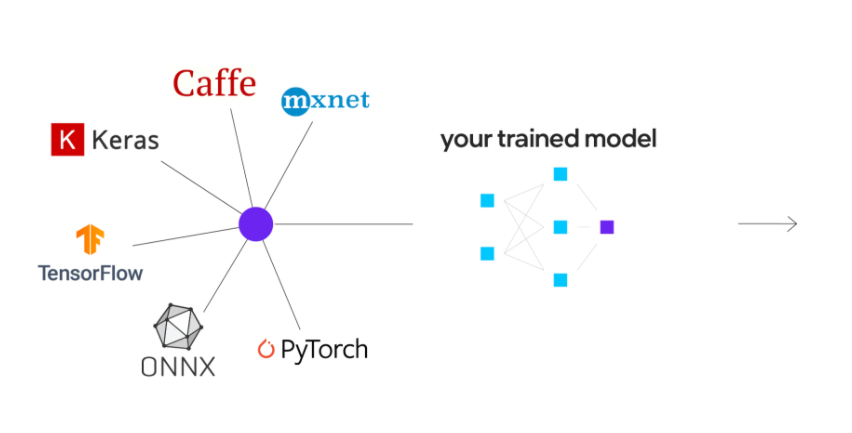
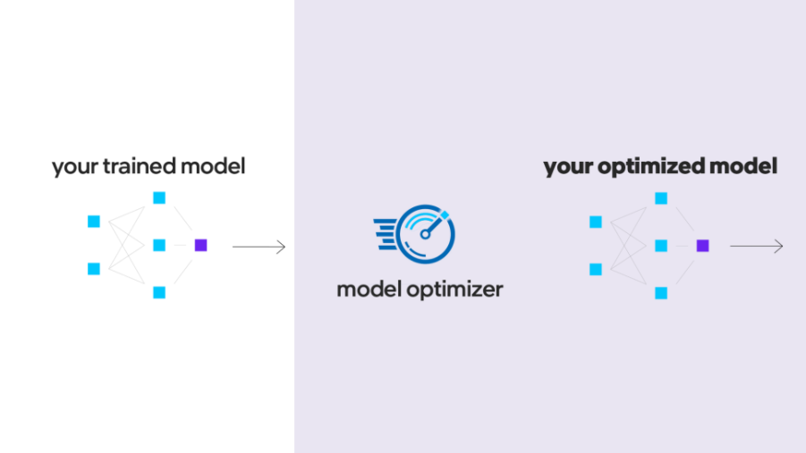
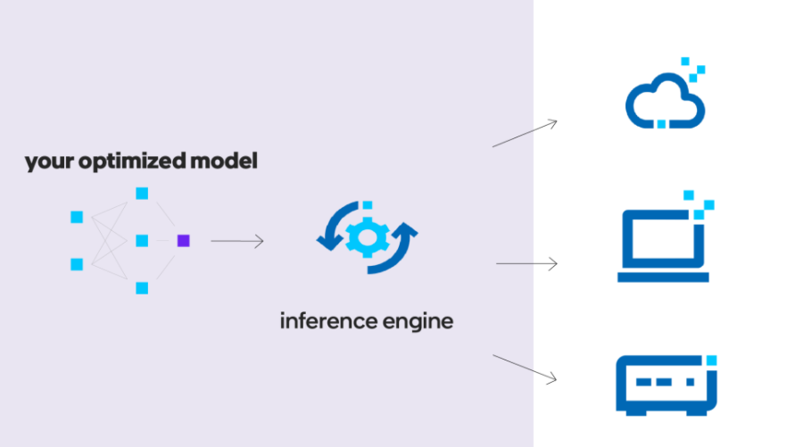
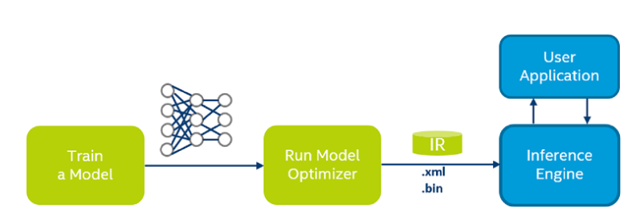
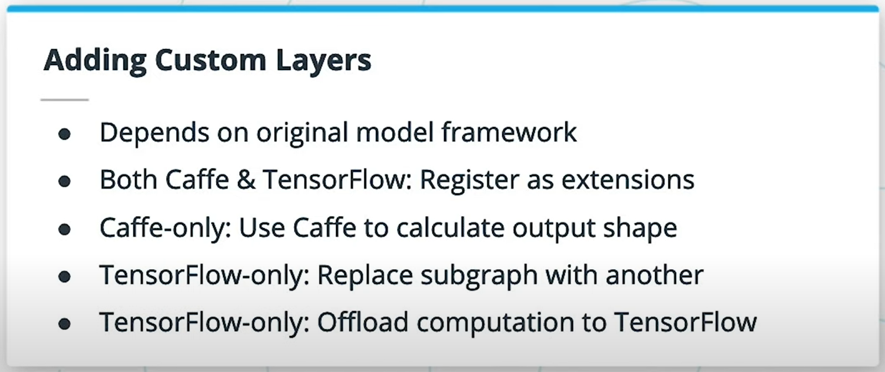
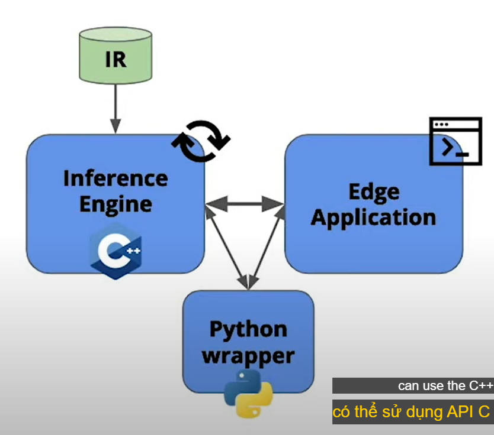
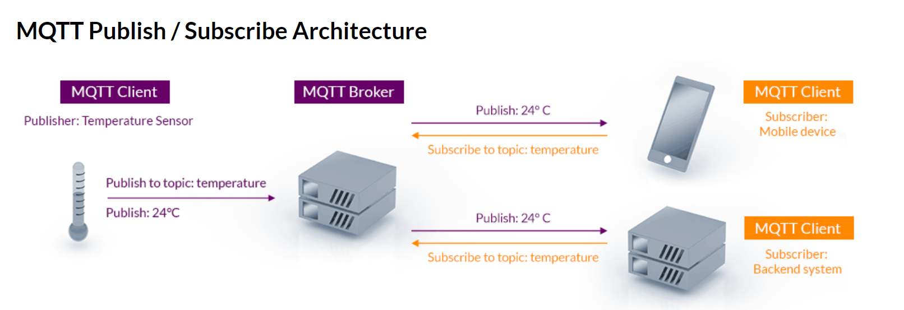

Course: https://www.udacity.com/course/intel-edge-AI-fundamentals-with-openvino--ud132

NOTE: version của openvino trong course này là 2019.R3, vì vậy có 1 số func đã deprecated

- Overview (nên đọc): https://viblo.asia/p/model-optimization-toi-uu-hoa-model-voi-openvino-toolkit-model-optimization-with-openvino-toolkit-924lJpPzKPM
- platform tương tự: [TensorRT](https://developer.nvidia.com/tensorrt)
- OWCT: GUI để sử dụng openvino => hợp nhất quy trình làm việc openvino: [introduce](https://www.thegioimaychu.vn/solution/qnap/openvino-workflow-consolidation-tool-p1588/),  [tutorial](https://www.qnap.com/en/how-to/tutorial/article/openvino-workflow-consolidation-tool-tutorial)


Flow:

build
==>  
optimize
==>  
deploy
==> 

# Install

[install guide](https://docs.openvinotoolkit.org/latest/openvino_docs_install_guides_installing_openvino_windows.html#Install-Core-Components)

[DL Workbench](https://docs.openvinotoolkit.org/latest/workbench_docs_Workbench_DG_Introduction.html)

# Lesson 2: Pre-trained models
## 1. Download pretrained models with downloader:

list models: https://docs.openvinotoolkit.org/latest/omz_models_group_public.html

```
cd /opt/intel/openvino/deployment_tools/open_model_zoo/tools/downloader

# download with -o
python downloader.py --name human-pose-estimation-0001 -o /home/workspace

# download with --precisions
python downloader.py --name text-detection-0004 --precisions FP16 -o /home/workspace
```

precision => mức độ chính xác của floating point values.
- less precision => tính toán nhanh hơn, nhẹ hơn => acc thấp hơn => trade-off

## 2. first-app
demo 1st app: bài tập trong phần này chỉ đang xử lý input (load, resize,...) và output (convert output sang format theo yêu cầu)

# Lesson 3: Model Optimizer
[workflow](https://docs.openvinotoolkit.org/2019_R3/_docs_MO_DG_Deep_Learning_Model_Optimizer_DevGuide.html)



- model optimizer là việc giảm model size để thực hiện inference nhanh hơn, ko fai tăng acc của model.
- thực tế, acc sẽ giảm, nhưng giảm rất ít (minimize)

local configuration:
```
cd /opt/intel/openvino (navigate to your OpenVINO™ install directory)
cd /deployment_tools/model_optimizer/install_prerequisites
./install_prerequisites.sh
```

## 1. Optimization Techniques
- quantization: là quá trình làm giảm độ chính xác của 1 mô hình khi inference (khi training thì độ chính xác là qtrong để đạt perfomance cao). openvino có 3 loại: FP32 (default), FP16, INT8 (chỉ có trong pretrained, model optimize chưa hỗ trợ)
- freezing: (sử dụng vs tensorflow model) => là bước xóa đi các operation/metadata chỉ có ích cho training (vd như backpropagation)
- fusion: là bước gộp các layer lại thành 1 => giảm số kernel (layer) cần fai đi qua

1 số technique khác để optimize model: https://docs.openvinotoolkit.org/2019_R3/_docs_MO_DG_prepare_model_Model_Optimization_Techniques.html


## 2. Convert Model
https://docs.openvinotoolkit.org/latest/openvino_docs_MO_DG_prepare_model_convert_model_Converting_Model.html

Example tensorflow: (lesson3-convert-model)
- note: freeze và unfreeze có cách xử lý khác nhau khi convert. Tuy nhiên freeze và unfreeze là concept của tensorflow, ko có trong framework khác
```
# download sample model object detection
wget http://download.tensorflow.org/models/object_detection/ssd_mobilenet_v2_coco_2018_03_29.tar.gz

# untar
tar -xvf ssd_mobilenet_v2_coco_2018_03_29.tar.gz

cd ssd_mobilenet_v2_coco_2018_03_29

# convert
python /opt/intel/openvino/deployment_tools/model_optimizer/mo.py --input_model frozen_inference_graph.pb --tensorflow_object_detection_api_pipeline_config pipeline.config --reverse_input_channels --tensorflow_use_custom_operations_config /opt/intel/openvino/deployment_tools/model_optimizer/extensions/front/tf/ssd_v2_support.json
```

- [convert caffe](lesson3-convert-model-caffe.zip)
    ```
    python /opt/intel/openvino/deployment_tools/model_optimizer/mo.py --input_model squeezenet_v1.1.caffemodel --input_proto deploy.prototxt
    ```
- [ONNX](lesson3-convert-model-onnx.zip):
    - Pytorch và Apple model chưa đc hỗ trợ trực tiếp => vì vậy cần convert sang ONNX rồi mới convert sang IR (sử dụng model optimizer)
    - chỉ có các arguments global, k có argument riêng như tensorflow
    ```
    python /opt/intel/openvino/deployment_tools/model_optimizer/mo.py --input_model model.onnx
    ```

## 3. Advance techniques
- trong 1 số trường hợp, có thể fai `cut 1 vài layer`, vd:
    - pre/post-processing
    - layer cần cho training, nhưng k dùng trong inference
    - model quá phức tạp, ko thể convert trong 1 lần
    ....

- thay vì fai check xem layer nào đc support trong IR, có thể thấy khi run model convert (ko rõ ở đây là thấy các layer đc convert hay các layer k đc convert)
- đối vs các layer k đc support, có thể:
    - tạo custom layer
    - sử dụng tf để load và process input cho layer mà `Model Optimizer` ko support => như vậy fai cắt model thành nhiều phần???

- [custom layer](https://docs.openvinotoolkit.org/2019_R3/_docs_MO_DG_prepare_model_customize_model_optimizer_Customize_Model_Optimizer.html): phụ thuộc vào framework mà có các cách add custom layer như (tuy nhiên cần check lại ở version mới có thay đổi gì ko, mình thấy trong version 2021.4 ko có document của phần này)



# Lesson 4: Inference

- inference engine đc build = C++ => có thể sử dụng C++ hoặc Python API.
- inference engine chỉ sử dụng đc model từ `Model Optimizer` hoặc `Intel® Pre-Trained Models in OpenVINO™` (IR format - gồm file .xml và .bin)


## 1. Load model
[lesson4-load-model-to-inference-engine](lesson4-load-model-to-inference-engine/)

- `IECore`: Python wrapper
- `IENetwork`: hold IR model and load to `IECore`

```
from openvino.inference_engine import IENetwork, IECore

plugin = IECore()
net = IENetwork(model=model_xml, weights=model_bin)

plugin.load_network(net, "CPU")
```
 

1 số useful func:
```
plugin.add_extension(CPU_EXTENSION, "CPU") => Add a CPU extension, đã bị deprecated từ 2020R1 

plugin.query_network(network=net, device_name="CPU") => load danh sách các layers mà IECore hỗ trợ

net.layers.keys() => load các layer có trong net
```

NOTE: `các layers mà IECore hỗ trợ khác gì vs layers trong network?`
- mặc dù có thể sử dụng Model Optimizer convert thành công sang IR, nhưng theo mình hiểu ko fai toàn bộ layers đều đc CPU hay GPU,... hỗ trợ => vì vậy tùy device(CPU/GPU,..) mà fai check lại xem nó hỗ trợ những layer nào, có hỗ trợ các layer có trong network ko
- 1 số layer CPU ko hỗ trợ, có thể đc hỗ trợ ở CPU extension => vì vậy mới fai add_extension (ko bắt buộc) => tuy nhiên option này đã bị deprecated


## 2. inference
- method .load_network() => return `ExecutableNetwork`: instance of a network
- có 2 loại inference request: đồng bộ và bất đồng bộ (Synchronous and Asynchronous):
    - đồng bộ sử dụng `infer` để inference
    - bất đồng bộ sử dụng `start_async` và `wait` => bất đồng bộ ko block main thread
- mỗi request sẽ đc lưu trong `InferRequest` object => cái này chứa cả input và output của request đó

### a. đồng bộ => return output
```
net = ...
....
input_blob = next(iter(net.inputs)) => layer input
result = net.infer({input_blob: image})
```


### b. bất đồng bộ => ko return
```
net = ....
input_blob = next(iter(net.inputs)) => layer input

net.start_async(request_id=0, inputs={input_blob: image})
status = net.requests[0].wait(-1) # if status == 0: break

result = net.requests[request_id].outputs
```

### c. outputs
bất kể là Synchronous hay Asynchronous, dữ liệu `inference requests` (bao gồm inputs, outputs, latency) sẽ đc lưu trong attribute `requests` của `net` (chính xác là `ExecutableNetwork`)

=> vì vậy có thể truy cập các thông tin đó từ `requests` attribute (và cách này sẽ đc dùng khi chạy bất đồng bộ do bất đồng bộ ko return output):
```
print(net.requests[request_id].outputs)
print(net.requests[request_id].inputs)
print(net.requests[request_id].latency)
```

# Lesson 5: Deploy an app

## a. MQTT
dùng để notify từ edge device


## b. FFmpeg
FFmpeg là lib dùng để streaming images/videos.
- tương tự như MQTT, FFmpeg cũng cần 1 server để nhận video frames mà edge device sent tới
- trong project của lesson này, FFmpeg đc setup cho phép `listen to the system stdout buffer` => vì vậy có thể khi dùng python có thể send video frame bằng `sys.stdout.buffer.write(frame)` trong lib `sys`

## c. Combine edge app - MQTT - FFmpeg
sau khi message/video frame đã đc sent lên MQTT/ FFmpeg server, có nhiều cách để có thể đọc data từ server. Tuy nhiên trong project của course này, tác giả build 1 simple web app để subcriber message từ MQTT và FFmpeg server (sử dụng node.js)

Sample project: https://www.youtube.com/watch?v=c2cNJgrvHmg
# Links
- OpenVINO™ on a Raspberry Pi and Intel® Neural Compute Stick: https://www.pyimagesearch.com/2019/04/08/openvino-opencv-and-movidius-ncs-on-the-raspberry-pi/

